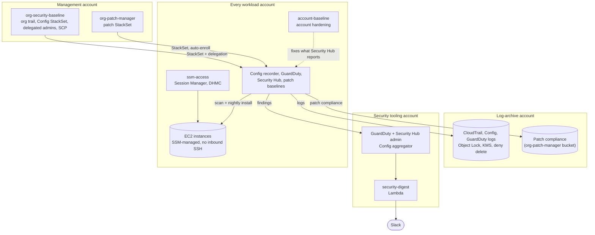

# aws-security-toolkit

**Five small, independently deployable modules that take an AWS Organization from default settings to a monitored, patched, tamper-resistant baseline. Each one ships as a Terraform module and as CloudFormation with a one-command deploy script.**

This repository is the index. The code lives in the module repositories below, so you can adopt one without the others.

## Modules

| Repository | What it does | Runs in |
|---|---|---|
| [org-security-baseline](https://github.com/simar-s2/org-security-baseline) | CloudTrail, GuardDuty, Security Hub (FSBP) and AWS Config in every account, with logs in a locked, encrypted log-archive account | Management, log archive and security accounts |
| [account-baseline](https://github.com/simar-s2/account-baseline) | One idempotent command for the account settings Security Hub flags on every new account: public access blocks, EBS encryption, password policy, default VPC report | Each account (script, Terraform, or an org-wide StackSet) |
| [org-patch-manager](https://github.com/simar-s2/org-patch-manager) | SSM Patch Manager in every account through a StackSet that enrolls new accounts automatically, with a tag deciding whether an instance may reboot | Management account, deploys to every account |
| [ssm-access](https://github.com/simar-s2/ssm-access) | Keyless instance access with Session Manager, plus SSH over SSM for VS Code with keys the instance accepts for 60 seconds | Each workload account |
| [security-digest](https://github.com/simar-s2/security-digest) | A daily Slack digest of Security Hub findings across the organization, with optional real-time alerts | Security account |

## Architecture



**How the pieces fit:**

- **org-security-baseline** turns detection on everywhere and stores the evidence where the accounts being watched can't change it.
- **account-baseline** fixes the per-account findings that Security Hub raises as soon as the baseline is on.
- **ssm-access** makes every instance reachable without SSH keys and managed by Systems Manager (Default Host Management Configuration), which is what **org-patch-manager** needs to scan and patch them.
- **security-digest** reads the aggregated findings, including patch health from org-patch-manager, and posts them to Slack every morning.

Each concern lives in exactly one module, and the others link to it instead of repeating it:

| Concern | Lives in |
|---|---|
| Log-archive buckets and KMS key | org-security-baseline |
| Patch compliance bucket (deployed into the log-archive account) | org-patch-manager |
| The `patch-reboot` tag and tagging existing instances | org-patch-manager |
| Making instances SSM-managed (instance profile, DHMC) | ssm-access |
| Per-account settings (EBS encryption, public access blocks, password policy) | account-baseline |
| Organization trusted access for the security services | org-security-baseline (`scripts/enable-trusted-access.sh`) |

## Quick start

You need an AWS Organization with a management account, a log-archive account and a security tooling account. Deploy in this order; each step links to its own quick start.

1. **[org-security-baseline](https://github.com/simar-s2/org-security-baseline#quick-start)**: enable trusted access once, then deploy the baseline across the three accounts.
   ```bash
   scripts/enable-trusted-access.sh --profile management
   scripts/deploy.sh --management-profile management --log-archive-profile log-archive \
     --security-profile security --regions us-east-1,us-west-2
   ```
2. **[account-baseline](https://github.com/simar-s2/account-baseline#quick-start)**: harden every account, now and in future, with a StackSet.
   ```bash
   scripts/deploy.sh --profile management --regions us-east-1,us-west-2 --targets r-ab12
   ```
3. **[ssm-access](https://github.com/simar-s2/ssm-access#quick-start)** in each workload account, with Default Host Management Configuration on.
4. **[org-patch-manager](https://github.com/simar-s2/org-patch-manager#quick-start)** from the management account, then tag the instances that may reboot.
5. **[security-digest](https://github.com/simar-s2/security-digest#quick-start)** in the security account, in the Security Hub home region.

Prefer Terraform? Every module has copy-paste usage in its README and runnable examples in `examples/`.

## Conventions

Every module repository follows the same layout, so moving between them is predictable:

- **Two deploy paths.** A Terraform module (AWS provider 6) with `examples/`, and CloudFormation templates with a `scripts/deploy.sh` that deploys everything in one command.
- **One `name_prefix`** (default `sec`) in front of every resource name, so the toolkit can live next to existing resources.
- **Tested without an AWS account.** `terraform test` against mocked providers, and pytest suites that run the scripts against a fake AWS CLI and the Lambda code against an in-memory Security Hub. `make test` never calls AWS.
- **The same CI everywhere.** GitHub Actions run `terraform fmt` and `validate`, `terraform test`, tflint (with the AWS ruleset), cfn-lint, checkov and shellcheck. Every checkov exception is skipped inline, next to the resource, with the reason.
- **A terminal recording** of each module in its README, made with [vhs](https://github.com/charmbracelet/vhs).

## Cost

GuardDuty, Security Hub and AWS Config, all turned on by org-security-baseline, are paid services billed per account and region; GuardDuty and Security Hub each start with a 30-day free trial, which shows your real numbers before you commit. The other modules cost little: account settings, Patch Manager, Session Manager and Instance Connect are free, and the rest is S3 storage, KMS keys, CloudWatch Logs and a Lambda function that runs once a day. Each README has a cost section with the details.

## License

[MIT](LICENSE)
